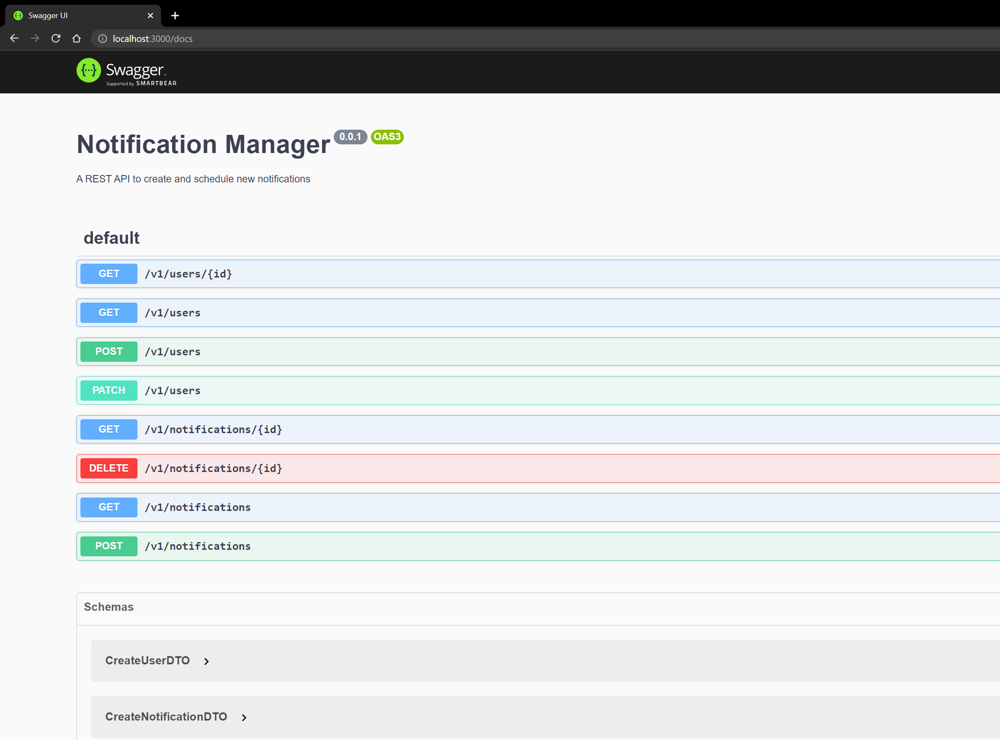

# Notifications API

  *The Notification Manager API for creating and scheduling new notifications*

## Installation

```bash
$ npm install
```

## Running the app

```bash
# development
$ npm run start

# watch mode
$ npm run start:dev

# production mode
$ npm run start:prod
```

## Using Docker

```bash
docker network create notifications-net
```

```bash
docker-compose up
```

## API Documentation (Swagger) 



Hit `/docs`
```bash
http://localhost:3000/docs
```


## Test

```bash
# unit tests
$ npm run test

# e2e tests
$ npm run test:e2e

# test coverage
$ npm run test:cov
```
